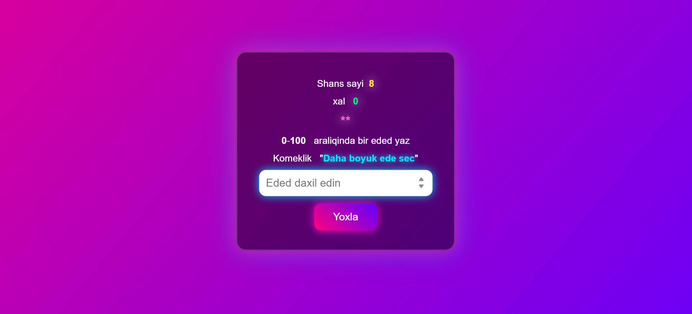

# 🎯 Rəqəm Təxmin Etmə Oyunu

Bu layihə sadə, interaktiv və əyləncəli bir **rəqəm təxmin etmə
oyunudur**. Kompüter təsadüfi bir rəqəm seçir və istifadəçi həmin rəqəmi
müəyyən olunmuş şans sayı ərzində tapmağa çalışır. Oyun istifadəçiyə
ipucları təqdim edir: təxmin olunan rəqəm gizli rəqəmdən böyükdür, yoxsa
kiçikdir.

------------------------------------------------------------------------

## 📌 Oyunun Xüsusiyyətləri

-   🔢 Təsadüfi rəqəm seçimi\
-   🧠 İpuçları (*çox böyükdür / çox kiçikdir*)\
-   ❤️ Şans sayının azalması\
-   ⭐ Xal sistemi\
-   👀 Oyunun sonunda doğru rəqəmin göstərilməsi\
-   🎮 Sadə və istifadəsi rahat interfeys

------------------------------------------------------------------------

## 🚀 İstifadə olunan texnologiyalar

Bu oyun tamamilə frontend texnologiyaları ilə hazırlanıb:

  -----------------------------------------------------------------------
  Texnologiya                              Təsviri
  ---------------------------------------- ------------------------------
  **HTML5**                                Strukturu yaratmaq üçün

  **CSS3**                                 Səhifənin vizual tərtibatı

  **JavaScript (ES6)**                     Oyun məntiqi, DOM idarəsi və
                                           təxminlərin yoxlanması
  -----------------------------------------------------------------------

------------------------------------------------------------------------

## 📸 Ekran Görüntüləri

Aşağıdakı şəkildə oyunun əsas interfeysini görə bilərsiniz:

### 🖼️ Oyun interfeysi

### 🔍 Təxmin zamanı

> **Qeyd:** Əgər bu şəkillər sizdə yoxdursa, layihə qovluğunda
> `screenshots` adlı qovluq yaradıb şəkilləri ora əlavə edin.

------------------------------------------------------------------------

## 🏁 Oyunun İş Prinsipi

1.  Oyun əvvəlcədən seçilmiş bir intervalda təsadüfi rəqəm müəyyən
    edir.\
2.  İstifadəçi input sahəsinə rəqəm daxil edib **"Yoxla"** düyməsinə
    klikləyir.\
3.  Sistem təxminlə müqayisə edir və ipucu verir:
    -   🔼 **Çox böyükdür**\
    -   🔽 **Çox kiçikdir**\
4.  Şanslar bitəndə oyun bitir və doğru rəqəm göstərilir.\
5.  Tapılan halda istifadəçi xal qazanır.

------------------------------------------------------------------------

## 📂 Fayl strukturu

    project-folder/
    │
    ├── index.html
    ├── style.css
    ├── app.js
    └── screenshots/
          ├── screen1.png
          └── screen2.png

------------------------------------------------------------------------

## 📜 Lisenziya

Bu layihəni istədiyiniz kimi istifadə edə və öz layihənizə uyğun şəkildə
dəyişə bilərsiniz.

------------------------------------------------------------------------

## ✨ Müəllif

Bu layihə **Shamil Axundbeyli** tərəfindən hazırlanmışdır.
